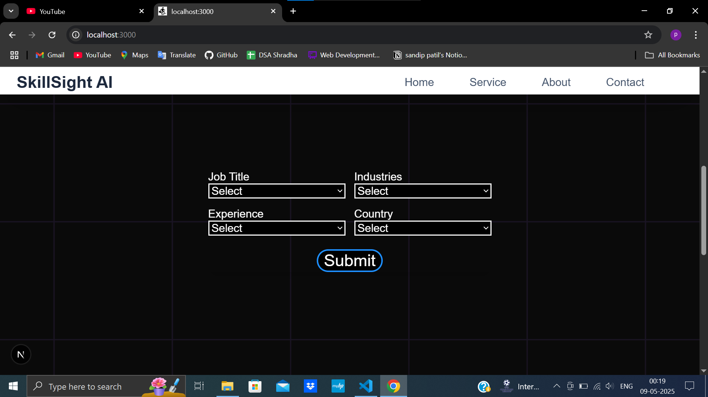

# 🧠 Smart Salary Predictor

A web application that provides estimated salary insights based on user-selected job roles, countries, experience, and skill levels. Useful for career planning and understanding global salary benchmarks.

## 🔧 Tech Stack

- **Frontend:** React.js, Next.js, Tailwind CSS  
- **Backend:** FastAPI  
- **Data:** Manually curated salary dataset by job role and country

## ✨ Features

- Predicts salary based on user input (role, location, skills, etc.)
- Modern UI with responsive design using Tailwind CSS
- FastAPI-powered backend for data processing
- Country-wise and role-wise salary mapping
- Skill level selection (Beginner/Pro) for better estimation

## 📸 Screenshots

```md




🚀 Getting Started (Local Development)
1. Clone the Repository

git clone https://github.com/sandippatil04/salary-predictor.git
cd ai-salary-predictor

2. Install Dependencies

# For frontend
cd frontend
npm install

# For backend (in another terminal)
cd backend
pip install -r requirements.txt

3. Run the App

# Start FastAPI backend (default on port 8000)
uvicorn main:app --reload

# Start Next.js frontend
npm run dev
Then visit: http://localhost:3000


